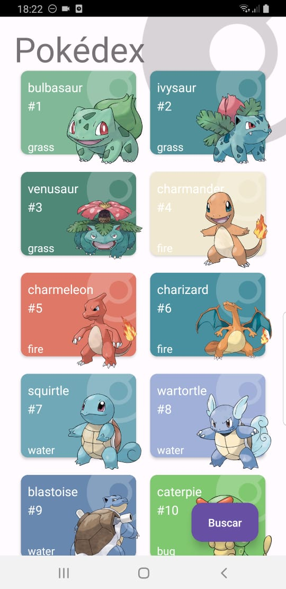
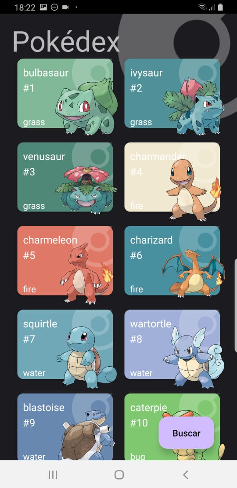
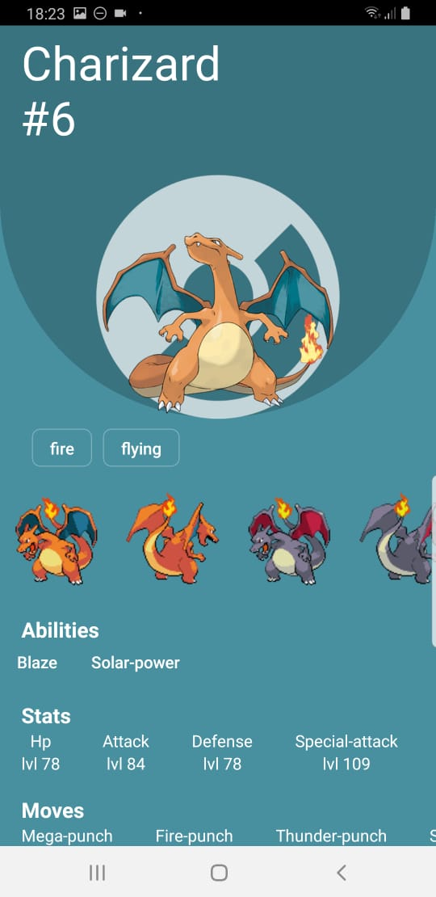
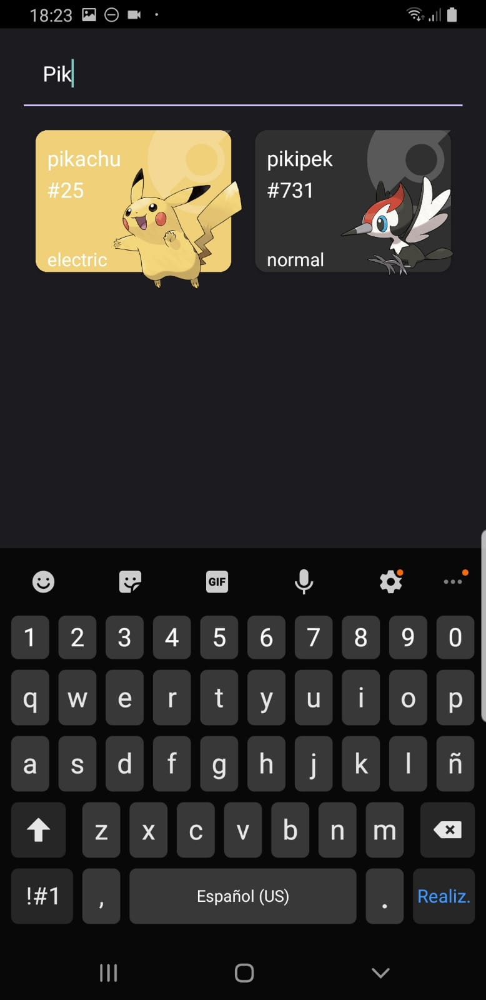
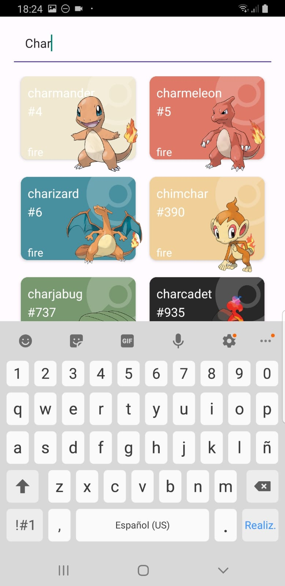

# Pokedex App

## Descripción
Aplicación en React Native que muestra información sobre Pokémons. Incluye consumo de APIs, reutilización de componentes, uso de TanStack Query, carga perezosa de imágenes, y manejo de caché. Proyecto del curso de React Native de Fernando Herrera en Udemy.

## Instalación

### Prerrequisitos
- Node.js >= 18
- React Native CLI
- Android Studio (para desarrollo en Android) o Xcode (para desarrollo en iOS)

### Pasos
1. Clona el repositorio:
   ```bash
   git clone https://github.com/tu-usuario/pokedex.git
   cd pokedex
2. Instala las dependencias:
   ```bash
   npm install
3. Instala las dependencias:
   ```bash
   npm start
4. Para correr en Android:
   ```bash
   npm run android
5. Para correr en iOS:
   ```bash
   npm run ios

### Uso
- Abre la aplicación en tu emulador o dispositivo.
- Explora la Pokedex y busca Pokémons por ID o nombre.
- Utiliza la búsqueda con caché y debounce manual.

## Capturas de Pantalla

Aquí hay algunas capturas de pantalla de la aplicación en funcionamiento:

### Pantalla Principal

<p align="center">
  
  
</p>
<p align="center">
Pantalla principal de la aplicación mostrando la lista de Pokémons y la pantalla de búsqueda. Se observa modo claro y oscuro.
</p>

### Detalle de Pokémon

<p align="center">
  
<p align="center">
   Detalles de un Pokémon mostrando información detallada y estadísticas.
</p>

### Busqueda de Pokémon

<p align="center">
  
  
</p>

## Contacto

Juandi - [GitHub](https://github.com/JuandiAndrade) - [LinkedIn](https://www.linkedin.com/in/juan-diego-andrade-polimeni-1a4501249/) - [juandi.andrade.g@gmail.com](mailto:juandi.andrade.g@gmail.com)
